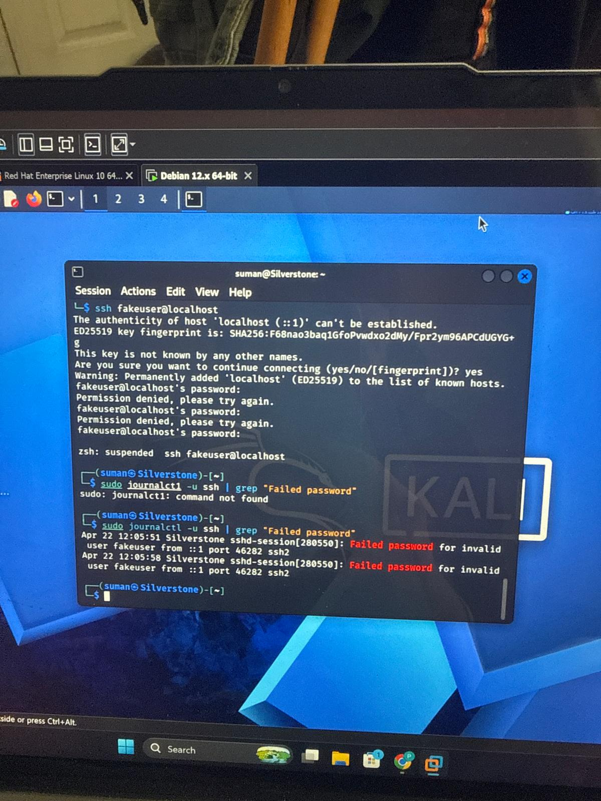
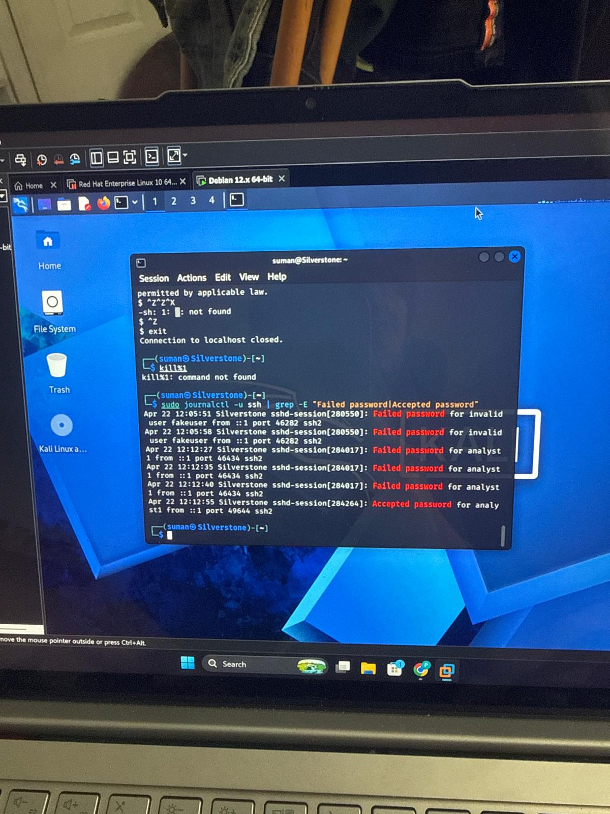
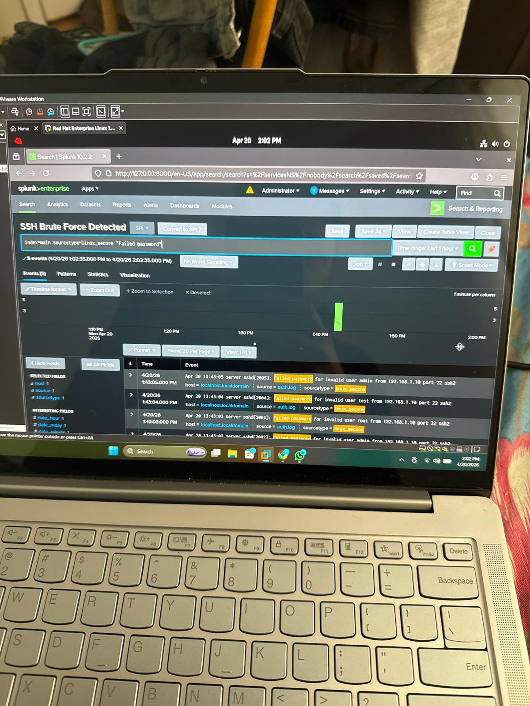

## 🧪 Day 01 — Authentication Log Analysis & Brute Force Detection

### 🎯 Objective
Analyze Linux SSH authentication logs to detect brute-force attempts and identify successful compromise patterns.

---

### 🧠 Scenario

Simulated attacker activity:

- Username enumeration (invalid user attempts)
- Password guessing (multiple failures)
- Successful login after repeated failures


### 🔍 Log Source

```bash
journalctl -u ssh
```

## 📸 Screenshots




